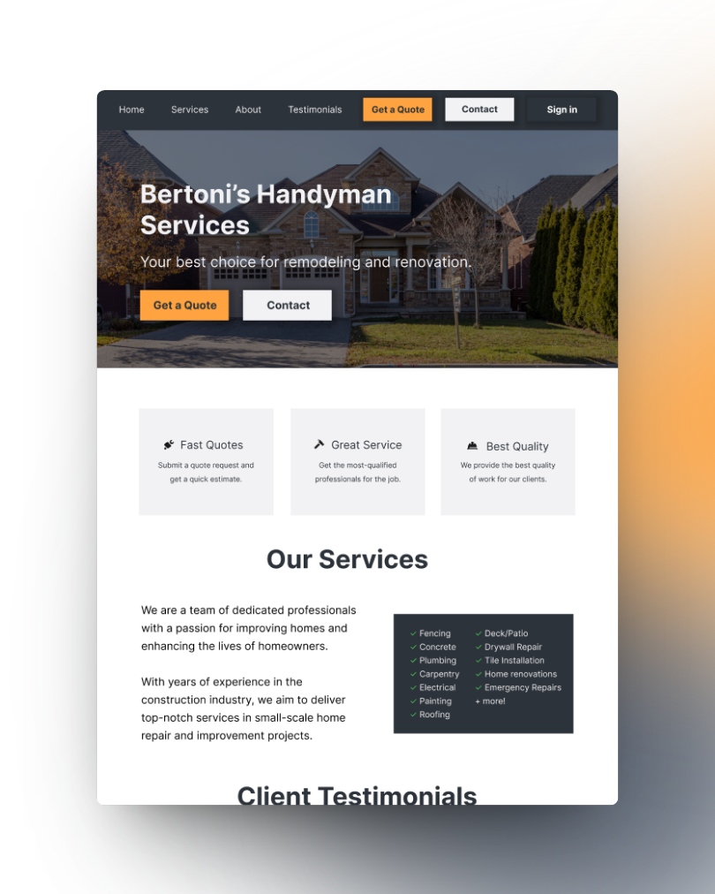
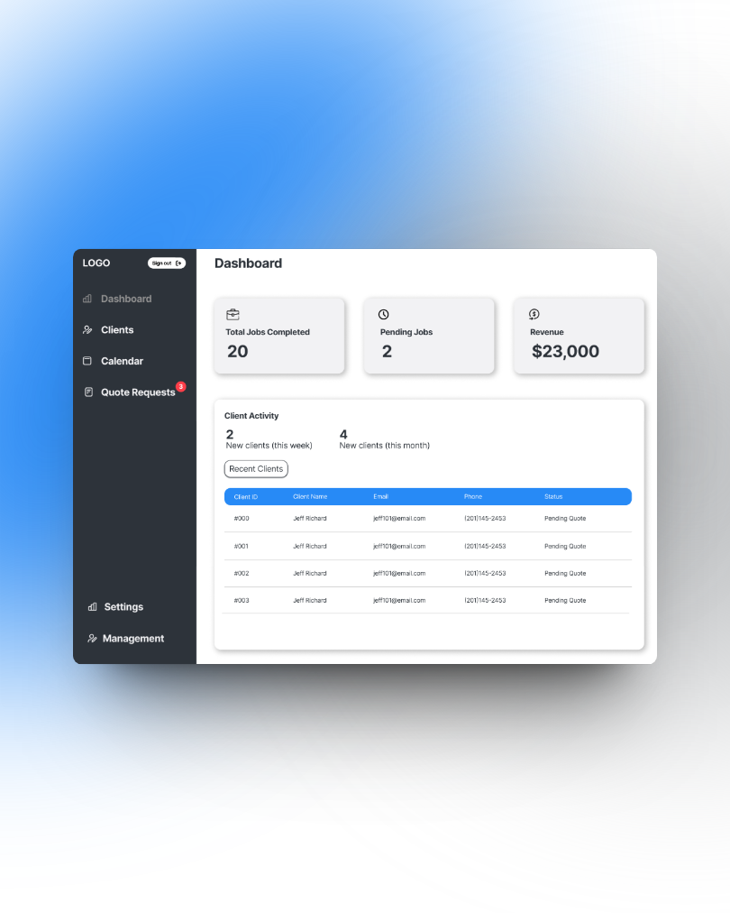
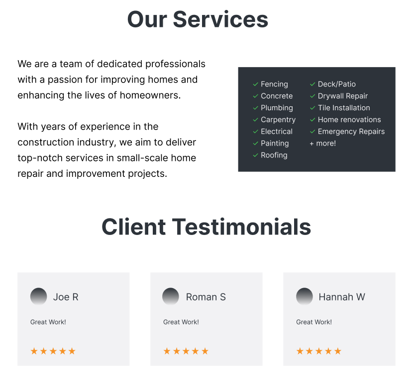
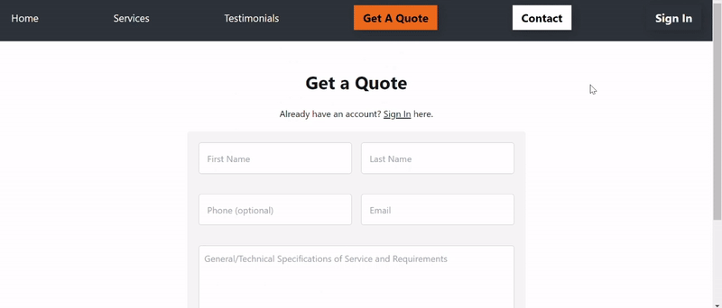
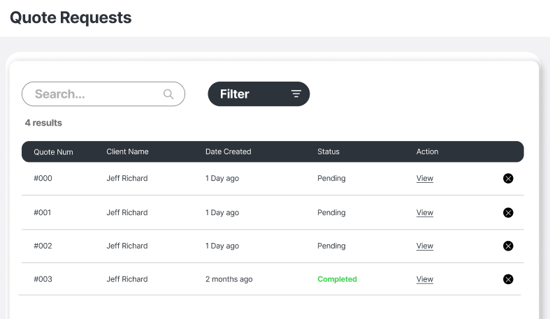
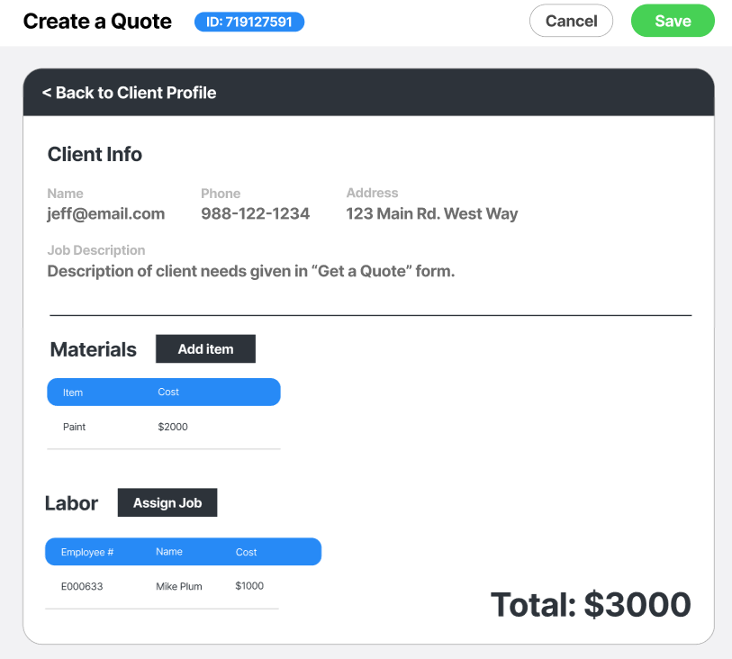

<p align="center"></p>
<p align="center"><em>A web application for a construction contractor business that includes quote, job, and employee management.
</em></p>
<br/>

<p align="center">
    <span style="padding: 2px 5px; text-align: center; background-color: #087FD2; color: white; height: 20px;">Typescript</span>
    <span style="padding: 2px 5px; text-align: center; background-color: #61DBFB; color: black; height: 20px;">React</span>
    <span style="padding: 2px 5px; text-align: center; background-color: #83CD29; color: black; height: 20px;">Nodejs</span>
    <span style="padding: 2px 5px; text-align: center; background-color: #55AD47; color: white; height: 20px;">MongoDB</span>
    <span style="padding: 2px 5px; text-align: center; background-color: black; color: white; height: 20px;">Vercel</span>
  </p>

<br/>
<br/>

  <center>
  
  
  </center>
<br/>

## Project Synopsis

Bertoni Handyman Services specializes in a range of home repair and improvement projects. This project involves the development of a comprehensive website that serves as a platform for clients to request quotes and schedule appointments, and for admins to manage these requests efficiently.

## Table of Contents

1. [Project Synopsis](#project-synopsis)
2. [Software Requirements](#software-requirements)
3. [Features and User Guide](#features-and-user-guide)
   - [Frontend](#frontend)
   - [Admin Portal](#admin-portal)
   - [Quote From Scratch](#quote-from-scratch)
4. [Database Structure](#database-structure)
5. [Testing](#testing)
6. [Deployment](#deployment)
7. [Developer Instructions](#developer-instructions)
8. [Timeline and Milestones](#timeline-and-milestones)
9. [Contact Information](#contact-information)

## Software Requirements

### Login Requirements

- Password and username complexity standards
- Hashing and 3rd party authentication mechanisms

### Database Requirements

- Data storage: Images, passwords, PII, sales, inventory, admin and user data
- Data removal policies
- ERD and other relevant diagrams

## Features and User Guide

### Frontend

- General information about the company
- Vouchers and reviews section
- Quote Request functionality

<p style="display:flex; flex-direction: column;">
    
&nbsp;
</p>



Mobile Application View


### Admin Portal

- Management of quote requests and user data
- Quote builder tool
- Chat functionality for client interactions

<p style="display:flex; flex-direction: column;">
    
&nbsp;
    
</p>

### Quote From Scratch

- Process for submitting quote requests
- User chat page for detailed discussion
- Steps following the submission of a request

## Database Structure

- Description of database objects: `JobRequest`, `Quote`, `User`, `Chat`
- 

## Testing

- Outline of testing strategies and methodologies

## Deployment

These steps outline how to deploy the Bertoni Handyman Services application to a production environment. Before deploying, make sure you have completed the necessary setup and configuration, including setting up your MongoDB database, configuring environment variables, and ensuring all dependencies are installed.

### Prerequisites

Before deploying the application, ensure you have the following prerequisites:

- Node.js and npm installed on your production server.
- A MongoDB database instance set up and accessible from your production environment.
- Properly configured environment variables (e.g., database connection details) in your `.env` file.
- A domain or server where you intend to host your application.

### Deployment Steps

Follow these steps to deploy the application:

1.  **Clone the Repository**:

    Use the following command to clone the project repository to your production server:

```
git clone https://github.com/seanthecod3r/Bertoni-Handyman-Services
```

2. **Frontend Deployment**:

   Navigate to the project directory and then to the frontend directory:

   ```
   cd Bertoni-Handyman-Services
   cd Frontend/bertoni-handyman-services/
   ```

   Install frontend dependencies:

   ```
    npm install
   ```

   Build the frontend for production:

   ```
   npm run build
   ```

3. **Backend Deployment**:

   Navigate to the project directory and then to the backend directory:

   ```
   cd Bertoni-Handyman-Services
   cd Backend/
   ```

   Install backend dependencies:

   ```
   npm install
   ```

4. **Start the Application**:

   Start the backend server:

   ```
   node server.js
   ```

It will typically run on http://localhost:3001.

## Developer Instructions

- Guidelines for developers contributing to the project

  ### Tech Stack used: MERN (MongoDB, Express.js, React.js, Node.js)

  **Client:** React, Redux

  **Server:** Node.js, Express.js

  **Database:** MongoDB

  ***

  ### Setting Up the Project Locally

  1.  **Clone the Repository**:

      Use this command to clone the project repository to your local machine.

      ```
      git clone https://github.com/seanthecod3r/Bertoni-Handyman-Services
      ```

  2.  **Install Node.js and npm**:
      - This project requires Node.js version `[specify version, e.g., 14.x]` and npm version `[specify version, e.g., 6.x]`.
      - Download and install them from [Node.js official website](https://nodejs.org/).

  #### Frontend

  - To run Frontend server, follow these steps:

    - Navigate to the project directory, then to the frontend directory:
      ```
      cd Bertoni-Handyman-Services
      cd Frontend/bertoni-handyman-services/
      ```
    - Install dependencies:

      ```
      npm install
      ```

    - Start the development server:
      ```
      npm run start
      ```
    - It will typically run on `http://localhost:3000`.

    ***

  #### Backend

  - To run Backend server, follow these steps:

    - Navigate to the project directory, then to the Backend directory:
      ```
      cd Bertoni-Handyman-Services
      cd Backend/
      ```
    - Install dependencies:

      ```
      npm install
      ```

    - Start the development server:
      ```
      node server.js
      ```
    - It will typically run on `http://localhost:3001`.

    ***

    ### Additional Notes

    - **Database Configuration**: Ensure that your MongoDB database is set up and running, and the connection details are correctly specified in the `.env` file.

    - **Package Versions**: If there are specific package versions required, they should be listed in your `package.json` file. Make sure to commit this file to maintain consistency across different setups.

    - **Troubleshooting**: If you encounter any issues during setup or running the servers, check the console for errors and ensure all environment variables and dependencies are correctly configured.

  ***

## Timeline and Milestones

- Key project milestones (sourced from JIRA)
- 

## Contact Information

- Sean Bertoni: bertoni.sean@gmail.com | (916)-508-1742
